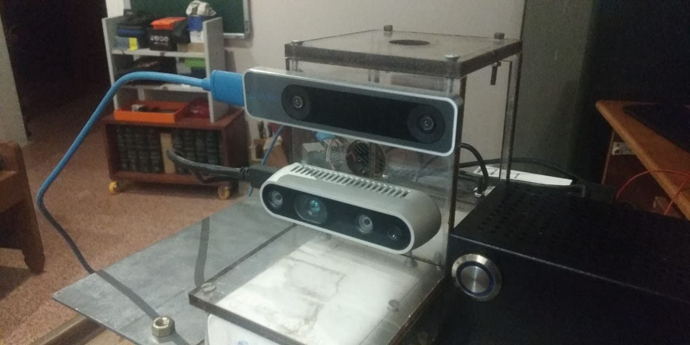
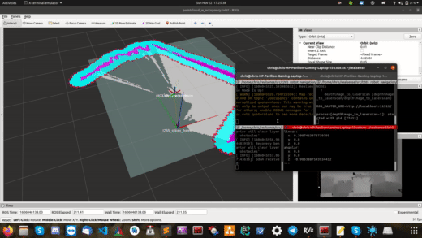

# T265 Robot Navigation




## Pre requisites 

```
sudo apt install python-catkin-tools

sudo apt install ros-melodic-depthimage-to-laserscan
```


Build from source


```
mkdir ~/realsense_ws/src -p
cd ~/realsense_ws/src
git clone https://github.com/chrissunny94/t265_robot_navigation
cd ..
catkin build
source devel/setup.bash

```


Please set the correct serial numbers of both the Realsense cameras 


*Use the following command to see the serial number of your cameras*

```
rs-enumerate-devices
```

It can be adjusted in the *cameras.launch* file

```
occupancy/launch/cameras.launch
``` 

PLEASE MAKE SURE YOU HAVE A PROPER RGID SETUP

To run the **Occupancy Grid Generator**

```
roslaunch occupancy occupancy_live_rviz.launch
```

To run the **Occupancy Grid Generator**(Without RVIZ)

```
roslaunch occupancy occupancy_live.launch
```


``

To run **move_base**


```
roslaunch jackal_navigation odom_navigation_demo.launch
```


If all goes well , you will be able to give a navigation goal via RVIZ by clicking on *2D nav goal*


[LINK TO YOUTUBE VIDEO](https://www.youtube.com/watch?v=ey9-tw8-N3g)





### Some additional INFO

(please save map in maps folder and change map file name in move_base_demo.launch file.....If we are using real robot, then change parameter of robot_base_frame from t265_link to base link in costmap_common.yaml file)


# iRNERO


Please set the correct serial numbers of both the Realsense cameras

Use the following command to see the serial number of your cameras

***This is required for using multiple Realsense cameras***

```
rs-enumerate-devices

```


edit the contents of **realsensecameras.launch** with the proper serial numbers of the individual Cameras .


Catkin build , source the workspace and then you should be good to go !


There are two configurations of the robot 

Please edit accordingly in the ***rur_navigation.launch***

#### Config 1

set *only_t265_camera*  = **true**,
set *both_realsense_camera*  = **false**,
set *lidar* = **true**

-  t265 
-  lidar
     


#### Config 2

set *only_t265_camera*  = **false**,
set *both_realsense_camera*  = **true**,
set *lidar* = false

-   t265
-   D435


```
rolaunch rur_navigation rur_navigation.launch

```


The above launch file will launch 

`- Lidar ROS drivers
 - T265 ROS drivers
 - move_base 
 - gmapping
 - RVIZ
 
 
 


Usefull Links that helped me solve this 

-------------------------------------------


-     https://msadowski.github.io/Realsense-T265-First-Impressions/
 
-    https://github.com/IntelRealSense/librealsense/blob/master/doc/t265.md

-    https://markku.ai/post/realsense-t265/


